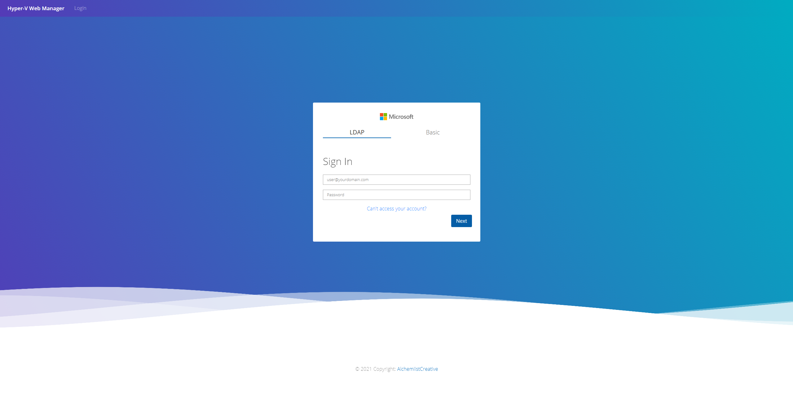
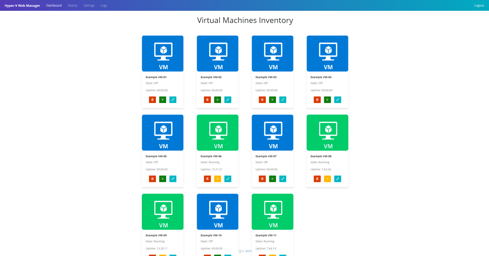

# Hyper-V Web Manager
**Hyper-V Web Manager** is a Web Dashboard that will allow to manage your Hyper-V Host ; 

Deploy, remove, edit, start your VM's from a Web GUI.

     
   
*LDAP* is supported to authenticate the user but there is also a basic login system.
## Requirements
The PowerShell Session is working through ssh, it doesnt support password authification so you will need to use **Pubkeyauthentication** between the Hyper-V host and the server.

The server and the Hyper-V host needs [Powershell 7.1](https://docs.microsoft.com/en-us/powershell/scripting/install/installing-powershell-core-on-linux?view=powershell-7.1)

## Usage

